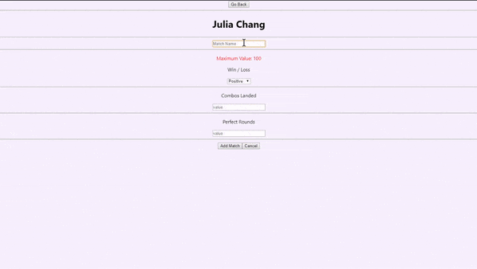

# pulseFG

---
pulseFG is a desktop application built with Electron + NodeJS, React, and SQLite. It is intended for tracking and cross referencing results of activities such as gaming or productivity. Data is displayed in a graph utilizing the [React-Vis](https://uber.github.io/react-vis/) library. 
- Each point in the x-axis can be targeted and clicked to get a readout of all fields in that entry. 
- Upon creation of a "session," each field can have a custom color assigned to its line via [React Color](https://casesandberg.github.io/react-color/).
- There are currently three "modes" for each line-graph: 
    - Score: Higher values are better
    - Binary: True / False
    - Placement: Intended for 'lower values are better,' **not implemented yet!**
- Additional displays of data, and additional widgets (ex: notes) are planned
- The above gif is just a basic example and makes no sense, I'm garbage at Tekken.
---
## Production Status
- This current commit has the project at its basic proof of concept. **All SQL methods written so far are for creation, no deletion methods exist yet.** 
- No stylization has been applied yet, however the React-Vis look and functionality is working as intended. 
- I've applied my own judgement on where to use class based or function based React components and features such as hooks, as well as where and how to modularize files.
- React components communicate to the SQLite functions via [Electron Promise IPC](https://www.npmjs.com/package/electron-promise-ipc)
- *Documentation is currently a work in progress, stay tuned!*
- The [DevNotes.md](DevNotes.md) provided in the project houses a lot of my thinking throughout the project.
---
## Installation
- Clone the repository
- Run ```npm install```
- The SQLite native libraries should be rebuilt automatically, if not run ```npm run postinstall``` 
- To build the app for windows run ```npm run electron-pack```
- For more information on building electron apps to other platforms: [Electron Builder](https://www.electron.build/)
---
This application is free open source under [MIT license](https://opensource.org/licenses/MIT).